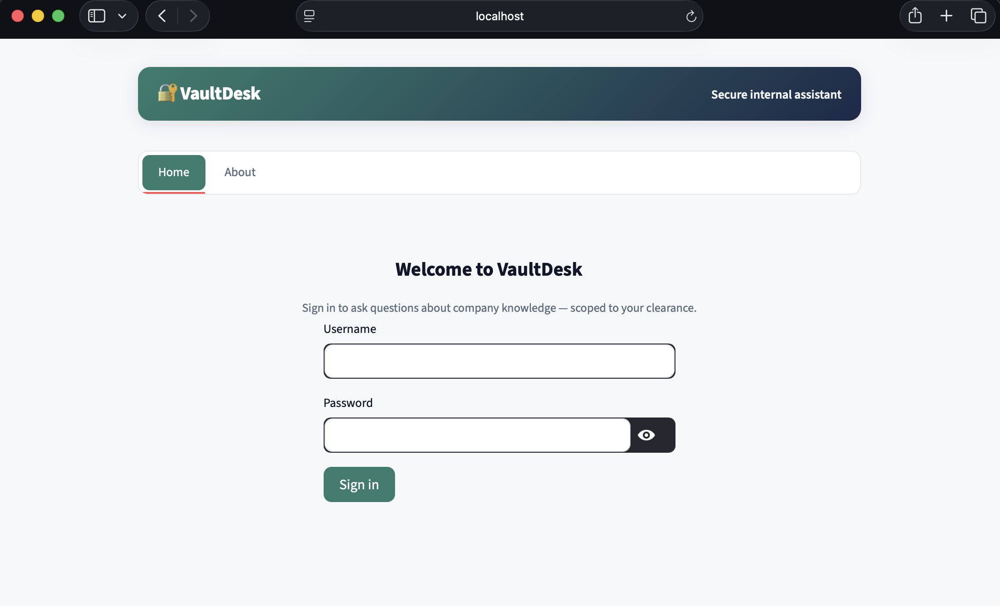
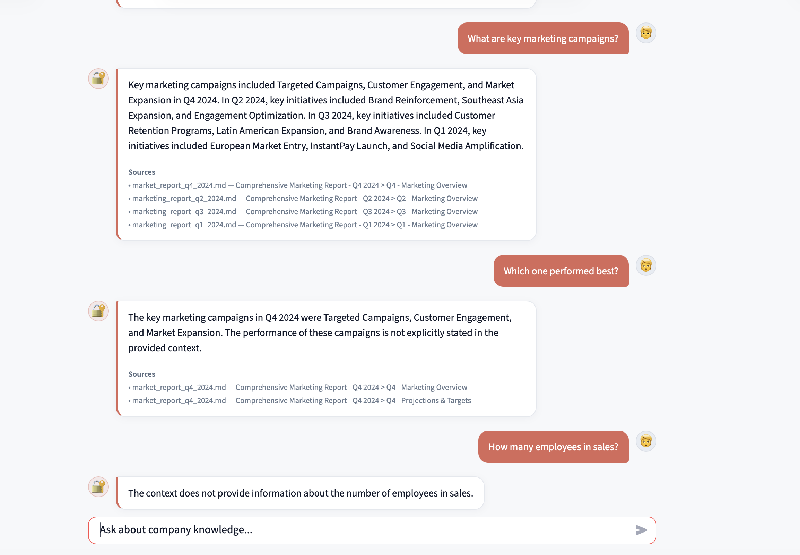
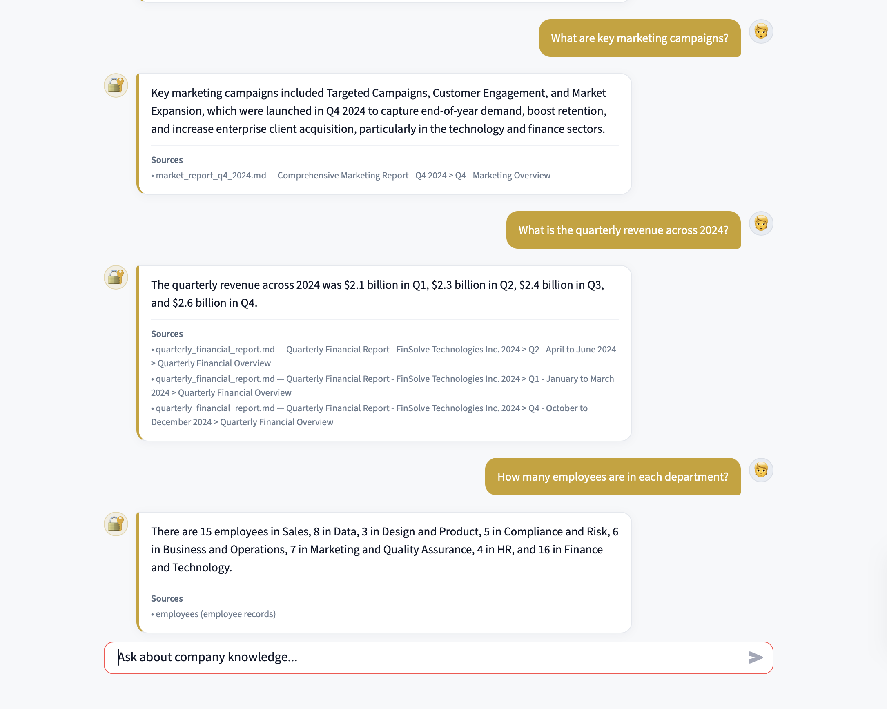
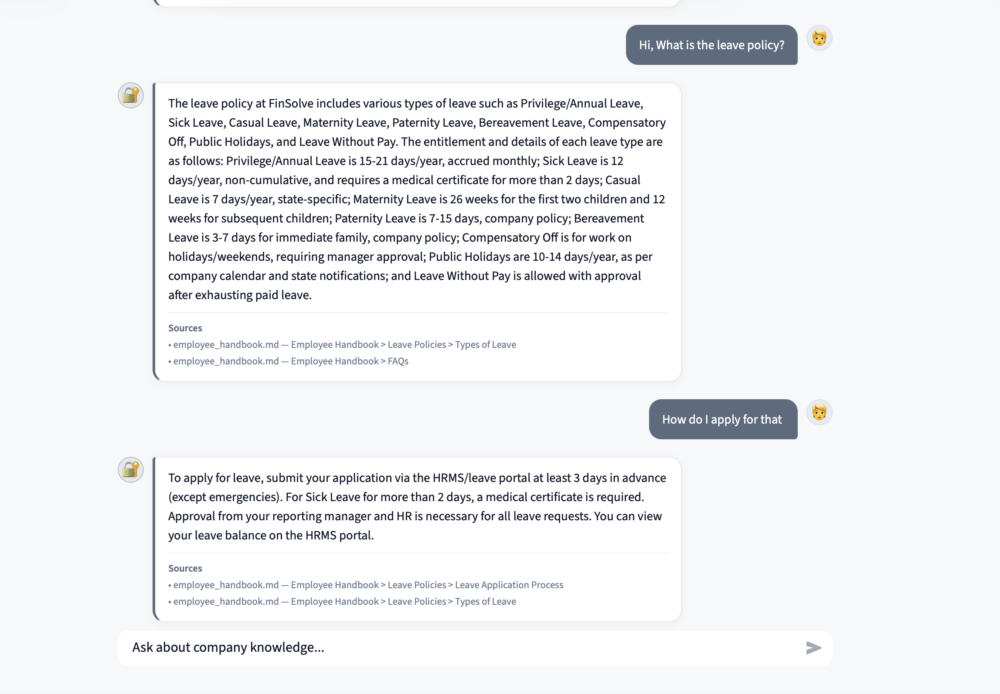
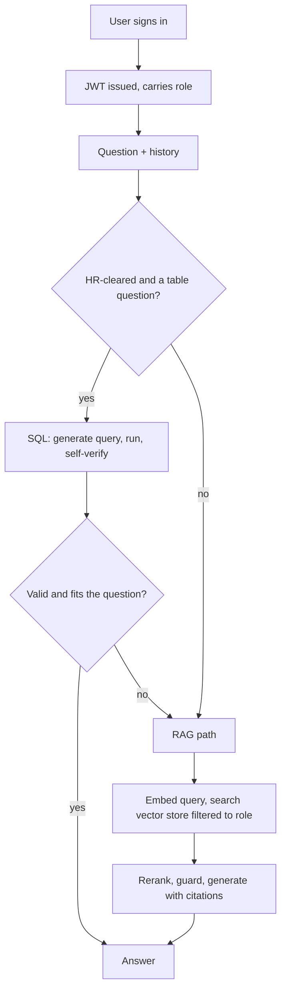

# 🔐 VaultDesk — Role-Based RAG Assistant

VaultDesk is an internal AI assistant that answers questions from company documents while respecting **role-based access control (RBAC)**. Each user sees only what their clearance permits — a finance user can't retrieve HR salary data, an employee can't see marketing reports, and a C-level executive sees everything.

It combines **retrieval-augmented generation (RAG)** for documents with **structured-query routing** for tabular data, all behind a secure, role-aware access layer.

---

## Screenshots

**Sign in — access is scoped to your clearance**



**Marketing user: answers campaign questions, but is denied employee data**

A single conversation showing both sides of access control — the marketing report is answered with citations, while a question about employee headcount (HR data) is correctly refused.



**C-Level executive: full access across departments, including exact SQL aggregations**

Marketing campaigns, quarterly revenue, and per-department headcounts — answered from documents and the employee database, each with its source.



**Engineering user: answers technical docs, denied HR data**



---

## Why it exists

Internal knowledge bases face a tension: make information easy to find, but don't leak sensitive data across departments. A naive chatbot with one shared knowledge base lets anyone surface anything. VaultDesk enforces access control **at retrieval time** — unauthorized data is never even fetched, so it can't reach the language model or the answer.

---

## The core insight

The company's knowledge isn't one kind of data — it's two:

- **Prose documents** (engineering, finance, marketing, general policies) — semantic search handles these well.
- **A structured employee table** (HR) — semantic search is *bad* at precise lookups over tabular data, because 100 near-identical rows look the same in vector space.

So VaultDesk routes each question to the right tool: structured questions (a person's salary, headcounts, averages) go to a **SQL engine** that queries the table exactly; everything else goes through the **RAG pipeline**.

---

## How it works

A signed-in user asks a question. The backend:

1. Verifies the user's **JWT** and reads their role.
2. **Rewrites** vague follow-ups into standalone questions using conversation history (only when the question actually depends on prior context).
3. If the user is cleared for HR data, tries the **SQL path**: generate a query, run it on the employee table, and verify the answer fits the question. Falls back to RAG if it's not a table question, the query yields nothing, or the answer doesn't fit.
4. Otherwise (or on fallback), runs **RAG**: embed the query, search the vector store *filtered to allowed roles*, rerank for precision, re-check access with a guard, and generate a grounded, cited answer.



---

## Key features

- **Role-based access control** — every document chunk is tagged by department. Retrieval is filtered to the user's allowed roles, then an independent guard re-checks each result before generation. Access is enforced across **both** the document and database paths.
- **Structured-query routing** — precise questions about employee data are answered with exact SQL queries (DuckDB), unlocking lookups *and* aggregations (counts, averages) that semantic search can't do.
- **Self-verification** — the SQL path checks that its answer genuinely fits the question (e.g. a "revenue" question isn't answered by summing employee salaries), falling back to RAG when it doesn't.
- **Cross-encoder reranking** — retrieved candidates are re-scored for relevance to sharpen precision.
- **Grounded, cited answers** — responses come only from retrieved documents or query results, with sources. No hallucination.
- **Structure-aware chunking** — Markdown split by heading hierarchy (preserving the heading path for citations); CSV rows converted to natural-language chunks.
- **History-aware retrieval** — context-dependent follow-ups are rewritten into standalone questions before retrieval; self-contained questions pass through unchanged.
- **Secure authentication** — JWT with bcrypt-hashed passwords; the role is carried in a signed token that can't be forged client-side.
- **Evaluation framework** — an automated pipeline generates a balanced test set from the documents and scores answers on faithfulness, relevance, and conciseness, enabling before/after measurement of changes.

---

## Results

Evaluated on a balanced test set (questions per department) scored on faithfulness, relevance, and conciseness:

| Change | Overall | HR score |
|--------|---------|----------|
| RAG baseline | 0.842 | 0.562 |
| + Reranker | 0.828 | 0.604 |
| + SQL routing | **0.862** | **0.733** |

The key finding: HR (tabular data) was the weak spot for pure semantic search, and **SQL routing lifted HR from 0.56 to 0.73** — a structural fix that retrieval tuning alone couldn't achieve.

A role-by-role behavior suite (six roles, with cross-department denials and conversational follow-ups) confirms RBAC holds across both the document and database paths — no role retrieves another department's protected data.

---

## Roles and access

| Role | Can access |
|------|-----------|
| Finance | Financial reports, expenses, reimbursements + general info |
| Marketing | Campaign performance, customer feedback + general info |
| HR | Employee records, payroll, attendance + general info |
| Engineering | Architecture, processes, operational guidelines + general info |
| C-Level | All company data |
| Employee | General company info only (policies, events, FAQs) |

---

## Tech stack

| Layer | Technology |
|-------|-----------|
| Backend API | FastAPI |
| Frontend | Streamlit |
| Vector store | ChromaDB |
| Embeddings | BAAI/bge-small-en-v1.5 |
| Reranker | BAAI/bge-reranker-base |
| Structured queries | DuckDB |
| LLM | Groq · Llama 3.1 |
| Auth | JWT + bcrypt |

---

## Project structure

- **app/** — the application
  - **main.py** — FastAPI app: `/login`, `/chat` endpoints
  - **schemas/chat.py** — request/response models
  - **services/**
    - **chunking.py** — documents → tagged chunks
    - **embeddings.py** — BGE embedding wrapper
    - **vectorstore.py** — Chroma build + RBAC-filtered search
    - **reranker.py** — cross-encoder reranking
    - **sql_engine.py** — DuckDB engine + read-only query guard
    - **router.py** — text-to-SQL with self-verification and RAG fallback
    - **rag.py** — orchestrates SQL fork + RAG path
    - **llm.py** — Groq calls + query rewriting
  - **utils/**
    - **auth.py** — JWT issue/verify, password hashing
    - **permissions.py** — role → allowed-roles map
- **frontend/** — Streamlit UI
- **scripts/**
  - **hash_passwords.py** — one-time: hash demo passwords
  - **evaluate.py** — RAG evaluation framework
  - **check_roles.py** — role-by-role behavior verification
- **resources/data/** — company documents, by department
- **chroma_store/** — persisted vectors (generated, gitignored)
- **users.json** — demo users (gitignored)
- **.env** — secrets (gitignored)

---

## Setup

### 1. Install dependencies

```bash
python -m venv venv && source venv/bin/activate
pip install -r requirements.txt
```

### 2. Configure secrets

Create a `.env` file:

```bash
GROQ_API_KEY=your_groq_key_here
JWT_SECRET=your_long_random_secret
```

Get a free Groq API key at https://console.groq.com. Generate a JWT secret with `python -c "import secrets; print(secrets.token_hex(32))"`.

### 3. Set up demo users and build the index

```bash
python scripts/hash_passwords.py
python -m app.services.vectorstore
```

### 4. Run

Backend (terminal 1):

```bash
uvicorn app.main:app --reload
```

Frontend (terminal 2):

```bash
streamlit run frontend/app.py
```

### 5. (Optional) Evaluate or verify behavior

```bash
python -m scripts.evaluate
python -m scripts.check_roles
```

---

## Demonstrating RBAC

Sign in as different roles and ask the **same question**:

- As a **Marketing** user: *"What were the key marketing campaigns?"* → a detailed, cited answer.
- As an **HR** user: the same question → *"I don't have that information."* — the marketing documents are outside HR's clearance and are never retrieved.

The contrast shows access control working at the data level, not just in the UI.

---

## Known limitations

- **Compound cross-department questions** — a single question spanning two sources (e.g. *"what were the marketing campaigns and what is the test coverage?"*) is routed to one path, so one half may go unanswered. The roadmap item below (table + text fusion) addresses this. Ask one topic per question for best results.
- **Small-model classification** — query routing runs on an 8B model, so genuinely ambiguous questions occasionally misroute; the self-verification step and RAG fallback mitigate this.
- **Scale** — demonstrated on a focused corpus (hundreds of chunks), not production-scale volumes.

---

## Roadmap

- **Table + text fusion retrieval** — answer mixed questions spanning both the employee database and policy documents in a single response, fusing structured and unstructured sources.
- **Audit & analytics dashboard** — surface query patterns, per-role usage, and access-denied events, turning the access-control layer into observable security insight.

---

## Notes

VaultDesk uses synthetic demo data for a fictional company (FinSolve Technologies). The vector store, `.env`, and `users.json` are gitignored and not included in the repository.
